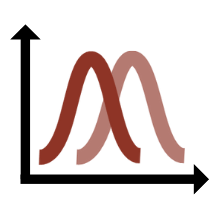

# evermore for ATLAS

If you are coming from the ATLAS experiment, you are probably familiar with the
[{math}`\pyhf`](https://github.com/scikit-hep/pyhf) project.

In the following, you will find a brief comparison how modifier types of
{math}`\pyhf` can be implemented in evermore.

## Simple Example (pyhf)

This is a simple example of a signal process scaled by an unconstrained modifier
{math}`\mu` and a background process with a normalization uncertainty (normsys).

::::{tab-set}
:::{tab-item} pyhf

```{code-block} python
import pyhf


workspace_json = {
    "channels": [
        { "name": "singlechannel",
          "samples": [
            { "name": "signal",
              "data": [12.0, 11.0],
              "modifiers": [ { "name": "mu", "type": "normfactor", "data": None} ]
            },
            { "name": "background",
              "data": [50.0, 52.0],
              "modifiers": [ {"name": "bkg_norm", "type": "normsys", "data": { "hi": 1.1, "lo": 0.9 }} ]
            }
          ]
        }
    ],
    "observations": [
        { "name": "singlechannel", "data": [51.0, 48.0] }
    ],
    "measurements": [
        { "name": "Measurement", "config": {"poi": "mu", "parameters": []} }
    ],
    "version": "1.0.0"
}

model = pyhf.Workspace(workspace_json).model()

# eval model to get expectation
model.expected_data(model.config.suggested_init(), include_auxdata=False)
# -> array([62., 63.])

model.expected_data([0.5, 1.12], include_auxdata=False)
# -> array([61.63265822, 63.35796454])
```

:::

:::{tab-item} evermore 

```{code-block} python
import jax
import jax.numpy as jnp
import evermore as evm


jax.config.update("jax_enable_x64", True)

params = {"mu": evm.Parameter(value=1.0), "bkg_norm": evm.NormalParameter(value=0.0)}

hists = {"signal": jnp.array([12.0, 11.0]), "background": jnp.array([50.0, 52.0])}

data = jnp.array([51.0, 48.0])


def model(params: dict, hists: dict) -> jnp.ndarray:
    mu_modifier = params["mu"].scale()
    syst_modifier = params["bkg_norm"].scale_log(up=1.1, down=0.9)
    return mu_modifier(hists["signal"]) + syst_modifier(hists["background"])


# eval model to get expectation
model(params, hists)
# -> Array([62., 63.], dtype=float64)

model({"mu": evm.Parameter(value=0.5), "bkg_norm": evm.NormalParameter(value=1.12)}, hists)
# -> Array([61.63265822, 63.35796454], dtype=float64)
```

:::
::::

## Modifier types

For a more detailed overview of modifier types in {math}`\pyhf`, please refer to
the
[{math}`\pyhf` documentation](https://pyhf.readthedocs.io/en/stable/likelihood.html#modifiers).

### Uncorrelated Shape (shapesys)

See
[shapesys](https://pyhf.readthedocs.io/en/stable/likelihood.html#uncorrelated-shape-shapesys).

::::{tab-set}
:::{tab-item} pyhf

```{code-block} json
{
  "name": "mod_name",
  "type": "shapesys",
  "data": [1.0, 1.5, 2.0]
}
```

:::

:::{tab-item} evermore 

```{code-block} python
from jaxtyping import Array
import jax.numpy as jnp
import evermore as evm


def fun(parameter: evm.Parameter, hist: Array) -> Array:
    return hist + parameter.value * jnp.array([1.0, 1.5, 2.0])

modifier = evm.Modifier(
    parameter=evm.NormalParameter(value=[0.0, 0.0, 0.0]),
    effect=evm.effect.Lambda(fun, normalize_by="offset")
)
```

:::
::::

### Correlated Shape (histosys)

See
[histosys](https://pyhf.readthedocs.io/en/stable/likelihood.html#correlated-shape-histosys).

::::{tab-set}
:::{tab-item} pyhf

```{code-block} json
{
  "name": "mod_name",
  "type": "histosys",
  "data": { "hi_data": [20, 15], "lo_data": [10, 10] }
}
```

:::

:::{tab-item} evermore 

```{code-block} python
import jax.numpy as jnp
import evermore as evm


param = evm.NormalParameter()

modifier = evm.Modifier(
    parameter=param,
    effect=evm.effect.VerticalTemplateMorphing(
        up_template=[20, 15],
        down_template=[10, 10],
    )
)

# or short-hand:
modifier = param.morphing(
    up_template=[20, 15],
    down_template=[10, 10],
)
```

:::
::::

(sec-normsys)=

### Normalisation Uncertainty (normsys)

See
[normsys](https://pyhf.readthedocs.io/en/stable/likelihood.html#normalisation-uncertainty-normsys).

::::{tab-set}
:::{tab-item} pyhf

```{code-block} json
{
  "name": "mod_name",
  "type": "normsys",
  "data": { "hi": 1.1, "lo": 0.9 }
}
```

:::

:::{tab-item} evermore 

```{code-block} python
import jax.numpy as jnp
import evermore as evm


param = evm.NormalParameter()

modifier = evm.Modifier(
    parameter=param,
    effect=evm.effect.AsymmetricExponential(up=1.1, down=0.9),
)

# or short-hand:
modifier = param.scale_log(up=1.1, down=0.9)
```

:::
::::

### MC Statistical Uncertainty (staterror)

See
[staterror](https://pyhf.readthedocs.io/en/stable/likelihood.html#mc-statistical-uncertainty-staterror).

::::{tab-set}
:::{tab-item} pyhf

```{code-block} json
{
  "name": "mod_name",
  "type": "staterror",
  "data": [0.1]
}
```

:::

:::{tab-item} evermore 

```{code-block} python
import jax.numpy as jnp
import evermore as evm


param = evm.NormalParameter()

# exemplary histogram with yield=10 and absolute uncertainty=0.1
hist = jnp.array([10.0])
rel_unc = 0.1 / hist

modifier = evm.Modifier(
    parameter=param,
    effect=evm.effect.Linear(offset=1, slope=rel_unc),
)

# or short-hand:
modifier = param.scale(offset=1, slope=rel_unc)
```

:::
::::

### Luminosity (lumi)

This modifier type can be implemented in the same way as the `normsys` modifier
type, see [](#sec-normsys). See
[lumi](https://pyhf.readthedocs.io/en/stable/likelihood.html#luminosity-lumi).

### Unconstrained Normalisation (normfactor)

See
[normfactor](https://pyhf.readthedocs.io/en/stable/likelihood.html#unconstrained-normalisation-normfactor).

::::{tab-set}

:::{tab-item} pyhf

```{code-block} json
{
  "name": "mod_name",
  "type": "normfactor",
  "data": null
}
```

:::

:::{tab-item} evermore 

```{code-block} python
import jax.numpy as jnp
import evermore as evm


param = evm.Parameter()

modifier = evm.Modifier(
    parameter=param,
    effect=evm.effect.Linear(offset=0, slope=1),
)

# or short-hand:
modifier = param.scale()
```

:::
::::

### Data-driven Shape (shapefactor)

See
[shapefactor](https://pyhf.readthedocs.io/en/stable/likelihood.html#data-driven-shape-shapefactor).

::::{tab-set}

:::{tab-item} pyhf

```{code-block} json
{
  "name": "mod_name",
  "type": "shapefactor",
  "data": null
}
```

:::

:::{tab-item} evermore 

```{code-block} python
import jax.numpy as jnp
import evermore as evm


# param.value is the shape factor, one value per bin
hist = jnp.array([10.0, 20.0, 30.0])
param = evm.Parameter(value=[0.0, 0.0, 0.0])

modifier = evm.Modifier(
    parameter=param,
    effect=evm.effect.Linear(offset=0, slope=1),
)

# or short-hand:
modifier = param.scale()
```

:::
::::
